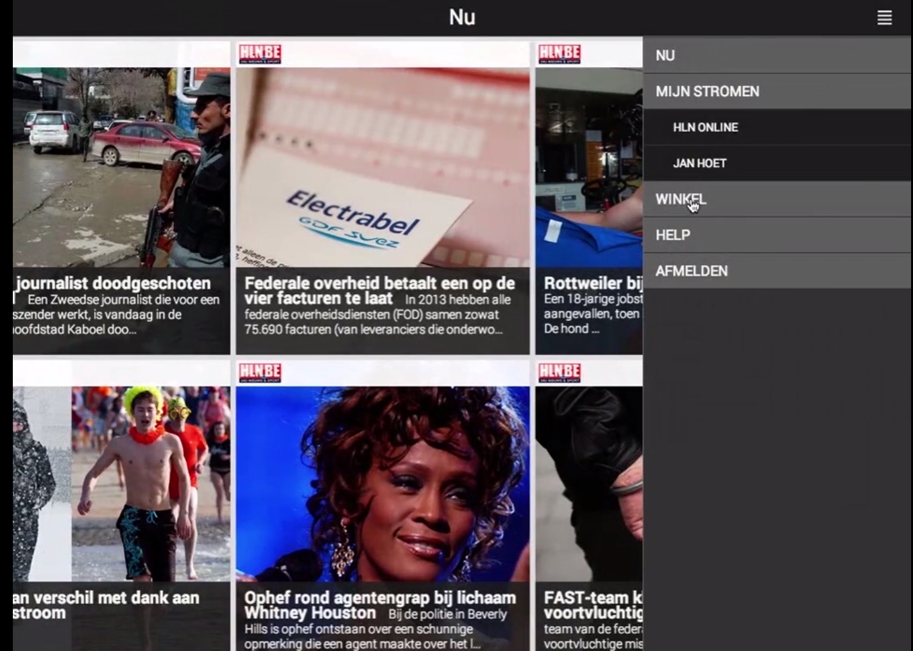
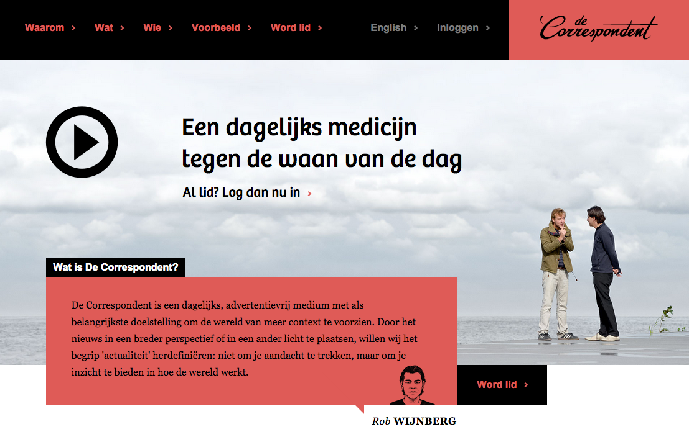
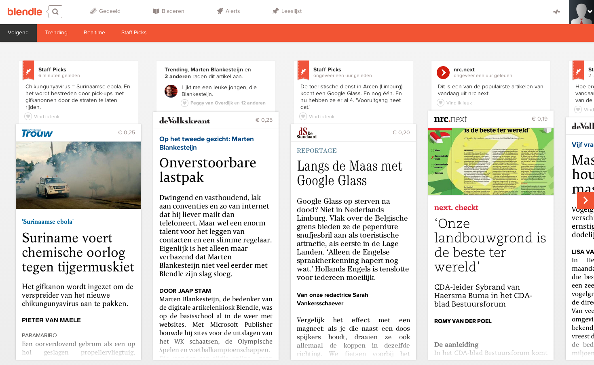
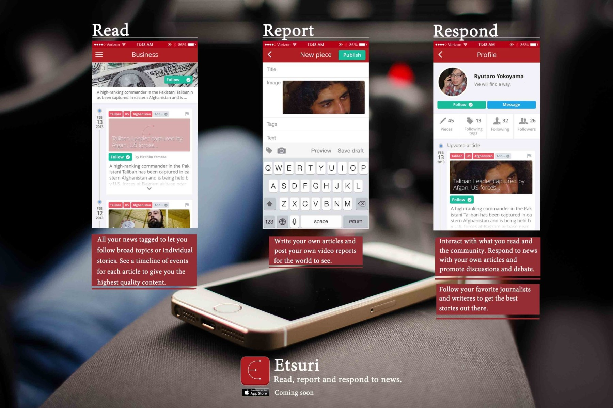
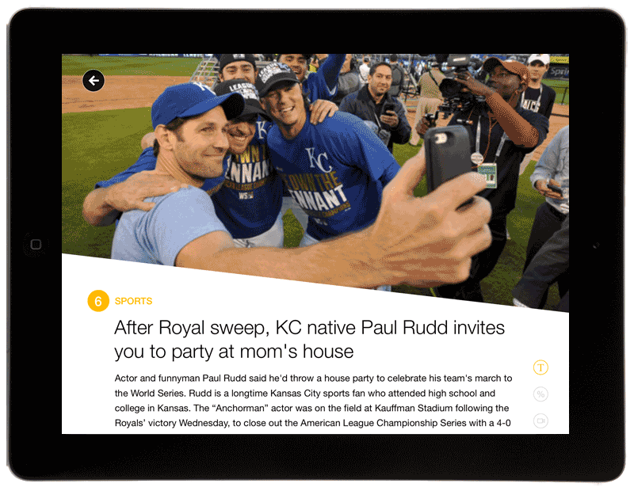
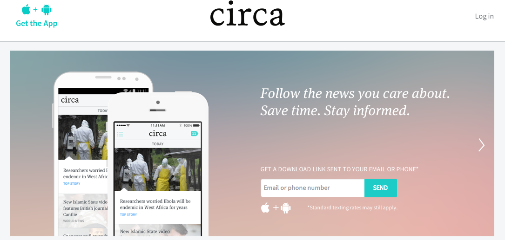
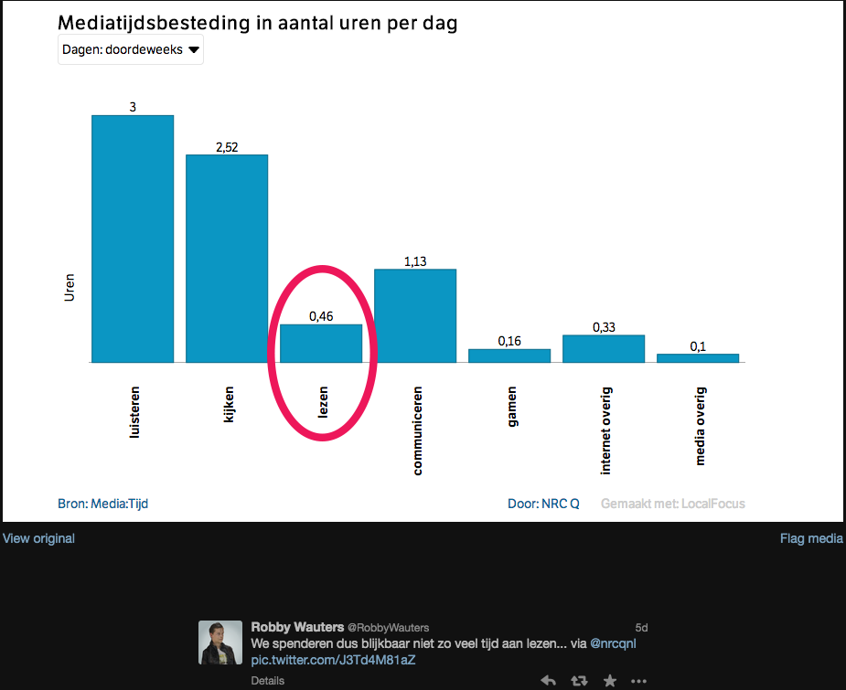
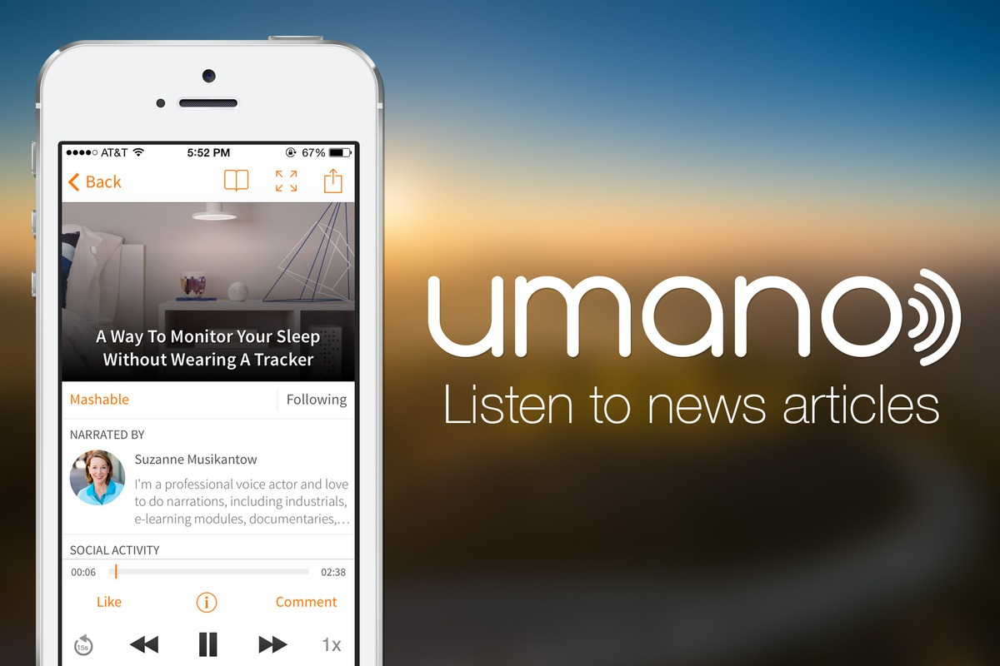
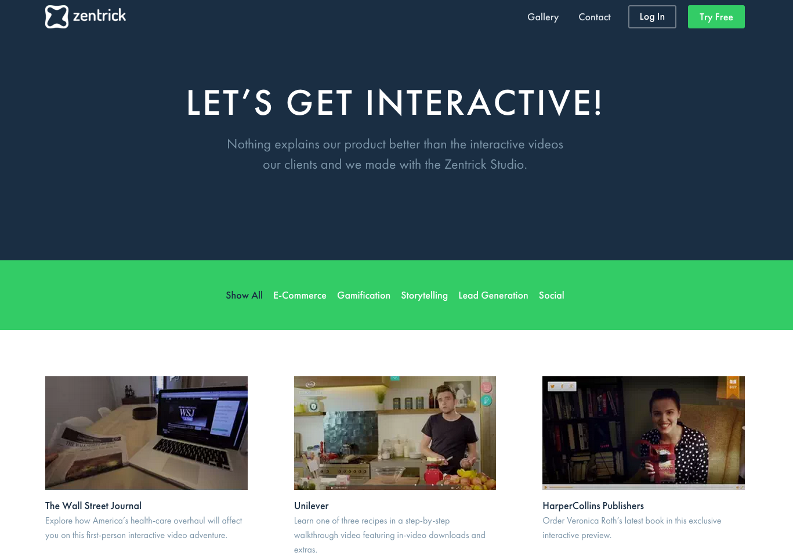
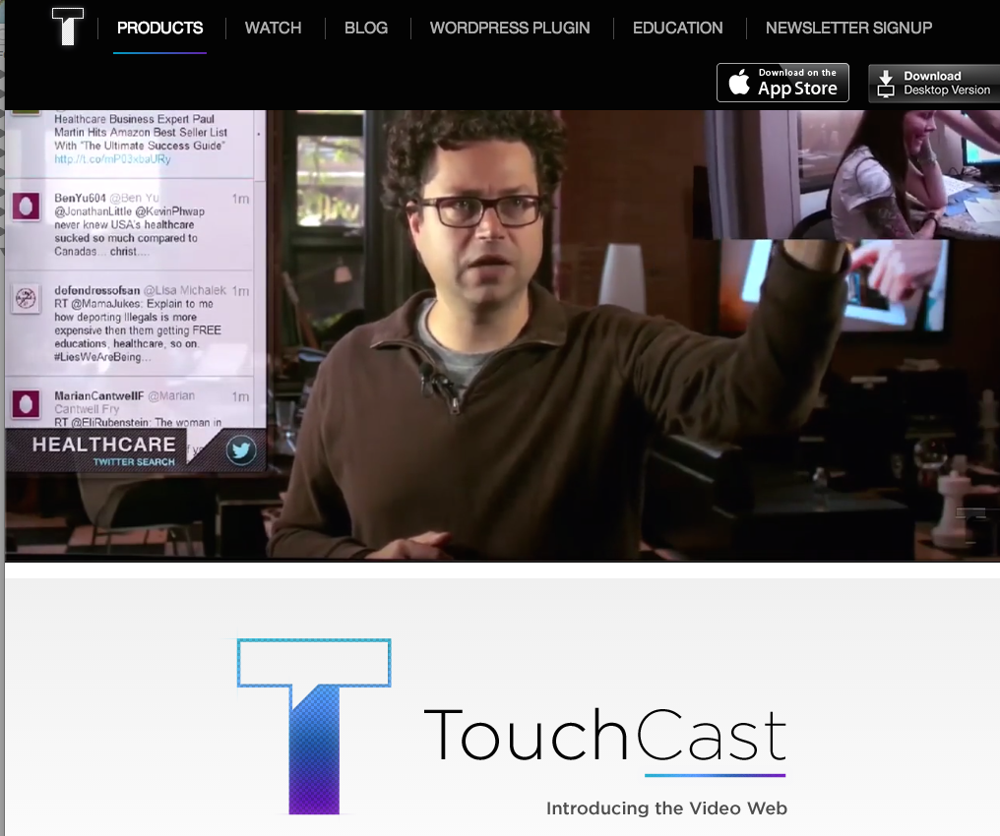

##devine - bachelorproef 2015
#nieuwsbeleving van de toekomst

#1
##state of the art

##op de volgende paginas zien jullie voorbeelden van enkele huidige newsapps

	

		

content van het web geplukt
		

content niet speciaal voor digitale consumptie
		

content van de vrienden/het netwerk
	

	

		

is er een expert dir content selecteerd
		

is er een tagbased (topic) machine selectie
	

	

		

geen transformatie
		

feedback mogelijk naar de creator
		

content wordt aangepast voor herpublicatie
	

##flipboard

[rss reading apps](https://www.google.be/search?q=flipboard+screenshot&safe=off&es_sm=91&tbm=isch&tbo=u&source=univ&sa=X&ei=tSFrVIHjG9XsaNW0gZAK&ved=0CCMQsAQ&biw=1676&bih=956#safe=off&tbm=isch&q=flipboard+pulse+feedly+google+currents&imgdii=_)

##streamstore

[streamstore homepage](http://www.iminds.be/nl/projecten/2014/04/17/stream-store)

##de correspondent

[http://cir.ca/](http://cir.ca/)

##blendle

[https://blendle.nl/](https://blendle.nl/)

##etsuri

[http://www.etsuri.com/](http://www.etsuri.com/)

##yahoo summary

[https://mobile.yahoo.com/newsdigest/?ss=iphone](https://mobile.yahoo.com/newsdigest/?ss=iphone)

##circa

[http://cir.ca/](http://cir.ca/)

#2
##huidige context

##mediatijdsbesteding

##multiscreen life
<iframe src="//player.vimeo.com/video/73286935" width="500" height="281" frameborder="0" webkitallowfullscreen mozallowfullscreen allowfullscreen></iframe> 
<a href="http://vimeo.com/73286935">Vigour Video</a> from <a href="http://vimeo.com/user18517960">Vigour.io</a> on <a href="https://vimeo.com">Vimeo</a>.

[vigour.io](http://vigour.io/)

##stevie
<iframe width="1131" height="636" src="//www.mystevie.com/mystevietv" frameborder="0" allowfullscreen></iframe>

##Umano

[https://umano.me//](https://umano.me/)

##video as an interactive platform

##zentrick

[https://www.zentrick.com/gallery](https://www.zentrick.com/gallery)

##touchcast

[http://www.touchcast.com/](http://www.touchcast.com/)

#3
##the challenge

#Wat is nieuws?
##2 paginas lang editoriaal?
##of liever [ninjanieuws](http://instagram.com/ninjanieuws?modal=true)?
##of gewoon facebook/twitter?
###if (form > function) {concept > content}

#Hoe consumeer je dit?
##Ga je voor de google glass?
##of liever de smartwatch?
##of gewoon een smartphone app?
##.
##en waarom is dit beter?

#succes

